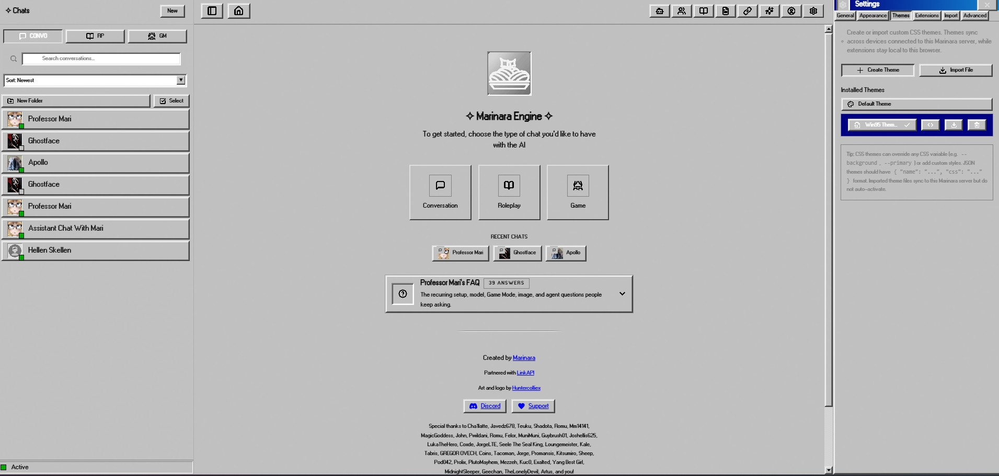
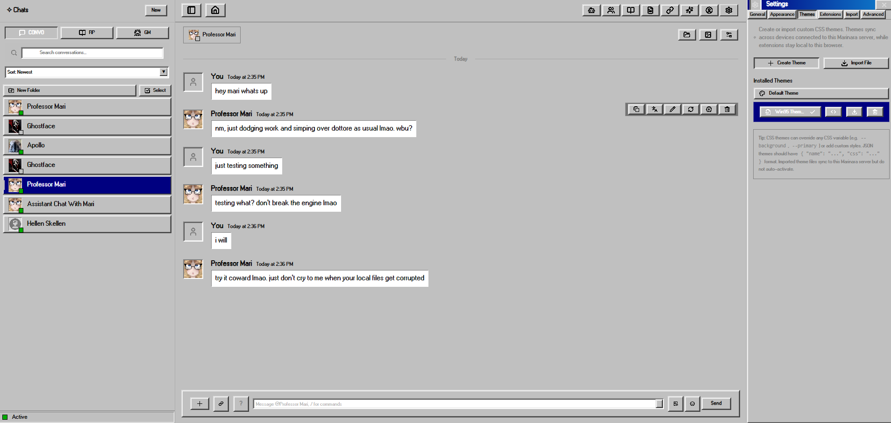
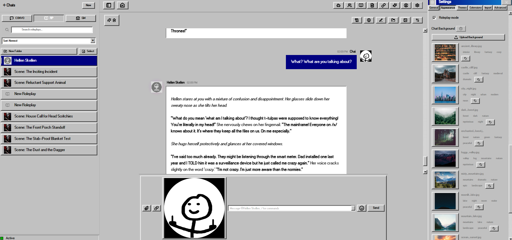
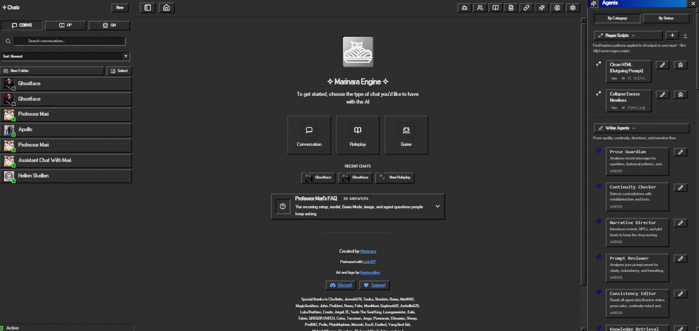

# Win95 Theme

A client-side **CSS-only** extension for [Marinara Engine](https://github.com/Pasta-Devs/Marinara-Engine) that re-skins the app as authentic Windows 95 — `#c0c0c0` gray fields, the classic blue title-bar gradient, the W95FA pixel font everywhere, beveled buttons, inset inputs, chunky 16 px scrollbars, and a `#000080` selection highlight.

It's a theme, not a window manager. Marinara's layout, navigation, and iconography are left alone.

> **v3.0** dropped the JavaScript layer (window chrome, pixel-art icon swap, boot splash, system sounds, working titlebar buttons, settings panel) in favor of a leaner pure-CSS theme that's simpler to maintain and less likely to break with engine updates. Earlier feature-rich releases are preserved in git history if anyone wants to fork the JS layer.

## Screenshots

### Home



The empty-state home: navy gradient titlebar, three Win95-button mode tiles (Conversation / Roleplay / Game), Recent Chats as raised buttons, expandable FAQ row, classic IE3-blue underlined links to Marinara / LinkAPI / Huntercolliex.

### Conversation



Live chat with Professor Mari. Chat list down the left (active row in flat navy + white text), conversation in the middle (user bubbles flat `#000080`, assistant bubbles white-on-grey), Settings → Themes panel on the right showing the `Win95 Theme` row selected.

### Roleplay + Appearance settings



Roleplay mode with Settings → Appearance open. Chat background image picker on the right, Win95 trackbars, Win95 combobox arrow buttons, navy user message bubble, sharp-cornered chrome throughout.

### Dark mode



Same chrome, dark palette. Flip the engine's **Settings → Appearance → Color Scheme** toggle to Dark and the whole theme swaps: face goes to `#2d2d2d`, text becomes `#e0e0e0`, links pop in `#6699ff`. Navy titlebars + cream-yellow tooltips stay the same in both modes (they read fine on either background). Bevel lightness ordering is preserved so beveled buttons / inputs / scrollbar thumbs still render correctly with the inverted palette.

## Installation

1. Open Marinara Engine.
2. Go to **Settings → Extensions → Add Extension**.
3. Open `win95-theme.json` from this folder, copy its full contents, and paste into the Add Extension dialog.
4. Save and confirm the extension is **enabled** in the extension list.

The skin takes effect immediately — no reload required.

## What it themes

- **Palette.** Overrides the engine's semantic CSS variables (`--background`, `--foreground`, `--card`, `--primary`, `--border`, etc.) so every component picks up the Win95 colors without selector wars. **Light + dark mode both supported** — flipping Marinara's Settings → Appearance dark/light toggle swaps the palette while keeping the same chrome / bevels / icons. Light is canonical Win95 (`#c0c0c0` gray, black text, `#000080` titlebar). Dark is a "what if Win95 had a dark mode" reskin (`#2d2d2d` face, light text, brighter `#6699ff` links) with the bevel lightness ordering preserved so 3D buttons still look right.
- **Typography.** W95FA pixel font is base64-inlined in the bundle. `--font-y2k` leads with `'W95FA', 'Pixelated MS Sans Serif', 'MS Sans Serif', 'Microsoft Sans Serif', Tahoma, Geneva, sans-serif`. Body size sits at `0.75rem` (≈ 12 px) so the bitmap font renders close to its native ~11 px sweet spot.
- **Buttons.** Raised bevel by default, pressed bevel on `:active`, dotted focus rectangle inside on `:focus-visible`. Disabled buttons get the etched gray text with the white shadow. Action buttons that the engine paints with `bg-[var(--primary)]` are flattened back to grey raised; segmented-toggle selected pills (`bg-[var(--primary)]/X` opacity variants) get the canonical Win95 pressed-in bevel.
- **Form controls.** Inputs, textareas, and selects use the inset bevel. `<select>` elements get a custom 16-px chunky 3D arrow button on the right via inline-SVG background. Checkboxes and radios are restyled to 13 × 13 px with the canonical checkmark / dot.
- **Scrollbars.** 16 px chunky webkit scrollbars with a patterned track, beveled thumb, and arrow buttons at each end (SVG triangles, no images bundled). The engine's `* { scrollbar-color }` rule is overridden via `@supports not (-moz-appearance: none)` so Chrome/Edge fall back to pseudo-element rendering. Firefox keeps `scrollbar-color` for its native styling.
- **Selection highlight.** Classic `#000080` blue with white text everywhere `::selection` applies. Sidebar/character-list selected rows use the same flat navy + white text.
- **Slider trackbar.** `<input type="range">` thumbs render as an inline-SVG pentagon — rectangular top + downward-pointing notch with a single-pixel light bevel on top/left and dark bevel on right + right diagonal. Authentic Win95 trackbar thumb.
- **Modals.** Modal native headers (`<h2>{title}</h2>` + close `<X>`) are restyled in-place as Win95 blue gradient titlebars with white title text and an inset Win95 close button.
- **Tooltips.** Cream-yellow `#ffffe0` background, 1-px black border, 1-px hard-offset shadow (no soft halo), W95FA font, sharp corners — the canonical Win95 tooltip look.
- **Universal flatten.** Every Tailwind `rounded-{sm,md,lg,xl,2xl,3xl,full}` → `border-radius: 0`; `bg-gradient-to-*` → flat face; `text-foreground/X` muted opacities → full-opacity black; named-color text utilities (`text-pink-X`, `text-amber-X`, etc.) → win95-text; `shadow-*` → none. All with chat-content carve-outs so message styling stays.
- **Hyperlinks.** Anchors inside chrome surfaces re-snap to the canonical IE3-era treatment: `#0000ee` blue underlined, `#551a8b` after visit.

## What it does NOT theme

- **Real window management.** No min/max/× titlebar buttons (those required JS to be functional, dropped in v3.0).
- **Pixel-art icons.** Lucide line icons stay as-is. Earlier versions shipped a 160+ icon SVG-replacement layer — see git history if you want to fork it back in.
- **A fake Start menu or taskbar.** Out of scope; would conflict with Marinara's real navigation.
- **Window chrome / status bar / boot splash / sounds.** All JS-dependent features removed in v3.0.
- **Sparkle removal.** `✧ Marinara Engine ✧` decoration around the home wordmark stays.
- **Native color picker.** `<input type="color">` field is wrapped in a Win95 sunken bevel, but the picker dialog opens in the browser's native UI — replacing it would need a real picker implementation in JS.

## How it works

- **CSS-only.** The engine's semantic tokens are re-pointed at the Win95 palette at `:root`, which paints every component automatically. Buttons, inputs, scrollbars, modals, sliders, comboboxes, tooltips, and selection are all styled via direct selectors + a layer of `[class*="..."]` Tailwind-utility flatten. No JavaScript runs.
- **W95FA bundled inline.** The font is base64-encoded into the `@font-face` `src` URL by `build.js` at bundle time. ~10 KB of base64 inside the JSON. If `w95fa.woff2` is missing from the repo root the placeholder stays as-is, the URL silently 404s, and the fallback font chain takes over.
- **Build script.** `node build.js` reads `win95-theme.css` + the WOFF2, normalizes line endings, and writes `win95-theme.json` (the pasteable extension blob).

## Known issues / limitations

- **DOM-dependent class selectors.** Many flatten rules target Tailwind utility-class substrings (`[class*="rounded-2xl"]`, `[class*="bg-gradient-to"]`, `[class*="text-pink-"]` etc). If the engine's Tailwind config changes the class generation pattern, those rules silently no-op.
- **`!important` everywhere.** Tailwind utilities are class-level (specificity `0,1,0`) and frequently bake right into engine JSX, so we use `!important` liberally to win the cascade. Documented inline in `win95-theme.css`.
- **Webkit-only scrollbar pseudo styling.** Firefox doesn't support `::-webkit-scrollbar-*`; we set `scrollbar-color` in an `@supports (-moz-appearance: none)` block so Firefox at least gets Win95 colors on its native scrollbar. Chrome/Edge get the full chunky bevel via pseudo-elements.
- **Modal backdrop.** Engine ships `[data-component="Modal"]` with an inline-style backdrop blur; overridden with `!important` to keep the Win95 face color visible.

## Compatibility

- Built against **Marinara Engine v1.5.5+**.
- Browser-sandboxed; runs in any browser Marinara supports.
- No Node at runtime, no JavaScript execution, no filesystem access, no external dependencies, no network calls, no schema changes. Pure CSS injected into a `<style>` tag.

## Build

If you fork this and want to rebuild:

```
node build.js
```

Reads `win95-theme.css` (+ `w95fa.woff2` if present) and writes `win95-theme.json`. CRLF normalized for byte-stable Windows commits.
